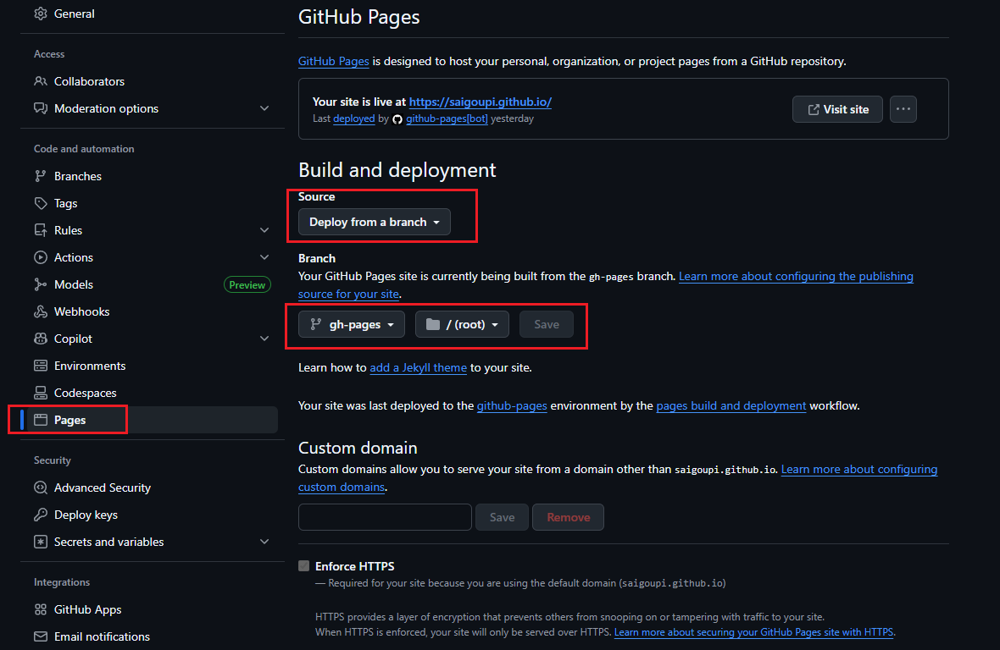

# 写在开头

最近在研究使用GitHub Pages搭建博客，好处有两点：
1. 免费，简单，不用租服务器买域名，一键部署
2. 教程多，出问题方便在网上找解决方案

GitHub Pages也支持很多博客框架，这里我用的官方推荐的Jekyll，当然用其他的Hexo，gitbook等等也都是可以的，网上教程也很多，部署流程也大同小异。

今天总结一下我的搭建过程，以及中途遇到的一些坑，照着这篇文档，应该能一次搭建成功。

# 参考文档

如果只是搭建一个最简单的博客，直接参考官方教程和以下教程即可，十分钟搞定直接开写：

[使用Jekyll + GitHub Pages搭建个人博客]:https://blog.csdn.net/zzy979481894/article/details/132678717
[GitHub Pages快速入门]:https://docs.github.com/zh/pages/quickstart
[GitHub Action]:https://docs.github.com/zh/actions/tutorials
[Jekyll主题大全]:http://jekyllthemes.org/
[Jekyll-yat主题]:https://github.com/jeffreytse/jekyll-theme-yat
[A GitHub Action to deploy the Jekyll site conveniently for GitHub Pages]:https://github.com/jeffreytse/jekyll-deploy-action
[Jekyll On Windows]:https://jekyllrb.com/docs/installation/windows/
[Error: Invalid CSS after " @if meta": expected "{", was ".function-exist..." on line 72]:https://github.com/jeffreytse/jekyll-theme-yat/issues/177
[css conversion error with github pages]:https://github.com/jeffreytse/jekyll-theme-yat/issues/173

* [使用Jekyll + GitHub Pages搭建个人博客]

* [GitHub Pages快速入门]


但是刚开始搭建博客时，总喜欢折腾一些好看的主题，Jekyll的主题很多，更换主题也很方便，但是还是会有一些小坑。

最主要的问题就是[GitHub Action]的配置，Jekyll可以使用在线主题，但是github默认支持的在线主题很少，如果想用其他的主题，就要修改博客项目中的默认的Action和workflow的配置，保证博客仓库有更新时，github可以自动部署博客到网页上。  

解决问题的方式很简单，只是第一次遇到有点懵而已。具体参考了以下链接：

* 在这里找到自己喜欢的主题：[Jekyll主题大全]

* 我使用的主题：[Jekyll-yat主题]

* 使用以上主题时，需要使用配套的Github Action配置：[A GitHub Action to deploy the Jekyll site conveniently for GitHub Pages]

* 安装Jekyll：[Jekyll On Windows]

一些疑难杂症的解决方案：
* [如何处理 Github Action 报出的 remote: Permission to xx x denied to github-actions[bot] 问题](https://www.ixiqin.com/2023/02/18/how-to-deal-with-making-the-action-report-remote-permission-denied-to-xx-x-to-making-the-actions-bot-problem/)

* [Error: Invalid CSS after " @if meta": expected "{", was ".function-exist..." on line 72]

* [css conversion error with github pages]

# 正式开始

全程在windows下操作，其他系统主要是安装Jekyll方式不同而已。

## 安装Jekyll

先在Ruby官网下载安装Ruby

[Jekyll On Windows]

在安装最后一步勾选以下选项


在命令行中选3


检查是否安装成功，windows命令行运行

```
ruby -v
gem -v
```

然后更换ruby源为国内源，因为ruby默认的官方源在国外，不用梯子的话，下载速度非常慢！所以先更换为国内源，再下载Jekyll，打开命令行，输入以下命令添加ruby国内源

```
gem sources -a https://gems.ruby-china.com/
```

然后输入以下命令移除官方源

```
gem sources -r https://rubygems.org/
```

最后使用以下命令查看已有的源

```
gem sources -l
```


接下来就可以安装Jekyll了，使用以下命令

```
gem install jekyll bundler
```

提示安装完成后，检查是否安装成功

```
jekyll -v
```

至此Jekyll安装完成

## 安装Jekyll-Yat主题

在github上新建一个博客仓库，克隆或者直接下载此主题的zip包[Jekyll-yat主题]，将此项目中的所有文件复制到自己的博客仓库。

参考[Jekyll-yat主题本地调试修改](https://github.com/SAIGOUPI/SAIGOUPI.github.io/commit/98e81254675ddf3308b2312be9e81b284fefb584)这个提交的修改，在`Gemfile`文件中再修改一次国内源，并添加`gem "logger", "~> 1.7"`和
`gem "bigdecimal", "~> 3.2"`，修改后完整文件如下：

```
source "https://gems.ruby-china.com/"
gemspec

gem "logger", "~> 1.7"

gem "bigdecimal", "~> 3.2"
```

然后在根目录启动命令行，输入命令

```
bundle install
```

开始在本地添加博客网站运行的依赖项，提示安装完成后，执行命令

```
bundle exec jekyll serve
```

就可以在本地`http://127.0.0.1:4000`访问渲染后的博客网站


至此，Yat主题初始化完毕

## 部署博客到GitHub Pages

来到自己的博客仓库，在`Settings`里第一行，修改仓库名字成`username.github.io`，`username`就是github的账户名。一定要按照这个格式输入，这个名字也是访问此博客的域名。


在部署GitHub Pages前，先回到自己的仓库，新建一个分支`gh-pages`，这个分支就用来部署博客页面。


分支创建完毕后，回到`master`分支上，需要修改一个文件`build-jekyll.yml`，路径如下：


然后将以下内容覆盖到`build-jekyll.yml`中，此配置来自Yat主题的作者[A GitHub Action to deploy the Jekyll site conveniently for GitHub Pages]，使用此Action就可以在master分支有更新时，通知github自动更新并部署博客页面到网站上，并且此配置也支持大部分Jekyll主题，部署时不会有报错：

```
name: Build and Deploy to Github Pages

on:
  push:
    branches:
      - master  # Here source code branch is `master`, it could be other branch
  workflow_dispatch:
    
jobs:
  build_and_deploy:
    runs-on: ubuntu-latest
    steps:
      - uses: actions/checkout@v4

      # Use GitHub Actions' cache to cache dependencies on servers
      - uses: actions/cache@v4
        with:
          path: |
            .asdf/**
            vendor/bundle
          key: ${{ runner.os }}-cache-${{ hashFiles('**/cache.key') }}
          restore-keys: |
            ${{ runner.os }}-cache-

      # Use GitHub Deploy Action to build and deploy to Github
      # For latest version: `jeffreytse/jekyll-deploy-action@master`
      - uses: jeffreytse/jekyll-deploy-action@v0.6.0
        with:
          provider: 'github'         # Default is github
          token: ${{ secrets.GITHUB_TOKEN }} # It's your Personal Access Token(PAT)
          repository: ''             # Default is current repository
          branch: 'gh-pages'         # Default is gh-pages for github provider
          jekyll_src: './'           # Default is root directory
          jekyll_cfg: '_config.yml'  # Default is _config.yml
          jekyll_baseurl: ''         # Default is according to _config.yml
          ruby_ver: ''               # Default is 3.2.0 version
          bundler_ver: ''            # Default is compatible bundler version (~>2.5.0)
          cname: ''                  # Default is to not use a cname
          actor: ''                  # Default is the GITHUB_ACTOR
          pre_build_commands: ''     # Installing additional dependencies (Arch Linux)
```

然后又来到项目的`Settings`中，进入`Action`-`General`路径中，找到`Workflow permission`，设置为`Read and write permissions`。这样在部署时，github就不会有无法操作仓库的权限问题了。


最后一步了！进入`Pages`路径，选择`Deploy from a branch`，然后选择`gh-pages`，保存修改，大功告成~！



来到仓库的`Action`页面，找到刚刚修改的Action，点击右侧Run workflow，启动部署流程，部署完成后，可以在下面的`pages-build-deployment`里看到，`gh-pages`分支已经部署完成


然后访问域名`username.github.io`就可以访问自己的博客了~!

## 本地写博客并更新到网站

在本地仓库内根目录下`\_posts`文件内，新建`date-blogTitle.md`文件，`date`是日期，`blogTitle`是文章标题，打开文件，在文章顶部填写基本信息

```
---
layout: post
title: Another test markdown
subtitle: Each post also has a subtitle
categories: markdown
tags: [test]
---
```

具体格式，可以参考`\_posts`文件内的其他实例文章，都是主题自带的案例，有图片，视频，Jekyll的基本格式，markdown基础语法等例子可以参考。

写好文章后，推送到github仓库上，就会触发Action的workflow，工作流执行完毕后（大约3分钟），就可以访问域名，查看更新后的博客了~

至此，就已经成功搭建起自己的博客了，完事开头难，基础搭建起来后，之后的各种玩法的探索才有了可能。接下来可以专注于博客的写作上，可以参考markdown的语法:

[Markdown语法](https://markdown.com.cn/basic-syntax/htmls.html)

也可以美化一下自己的博客，学习一下Jekyll主题的修改和制作

## 写在最后

搭建博客时还是踩了不少坑，所以深知能从零搭起来才是最重要的，其他花里胡哨的外观主题都是次要的。按照这篇文章，应该能顺利地一次性搭建起来，如果有问题，可以看看我的博客的仓库，里面的提交和文件都可以参考。

[赛狗屁的博客仓库](https://github.com/SAIGOUPI/SAIGOUPI.github.io)

另外，现在的我在用vscode写这篇文章时，发现vscode写markdown真的非常方便，原生就支持直接粘贴图片到文章内，附上文档链接

[vscode支持Markdwon中直接粘贴图片](https://juejin.cn/post/7244809769794289721)

感谢看到这里~！